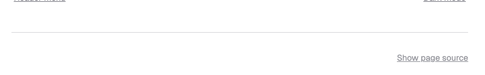
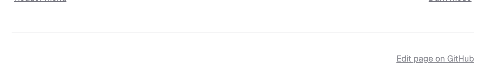
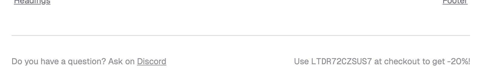

{#custom-article-footer}
# Article footer

The article footer appears at the bottom of every page, below the main content and article navigation. It shows a page source link by default, but you can enable an edit page link and inject arbitrary HTML by overriding the respective Jinja blocks.

## View page source

By default, the theme adds a link to view the source of a page (i.e., the underlying reStructuredText or MyST Markdown for the page). 

(This is controlled by the Sphinx options `html_show_sourcelink` and `html_copy_source`, which are both true by default.)



(disable-view-page-link)=
:::{rubric} Disable view page link
:::

To disable it, use the following configuration:

```py
html_show_sourcelink = False
```

## Edit page source

You can add a link to edit the page source on every page, enabling users to directly modify the documentation and submit a pull request with their changes.

Two theme options control the "edit page" link:

- `edit_page_label`: the link text
- `edit_page_url`: a template to build the edit URL, where `{filename}` will be replaced by the page source filename
- both `edit_page_label` and `edit_page_url` must be set

The URL template `edit_page_url` is, e.g., for GitHub in format `https://github.com/<org>/<repo>/edit/<branch>/<filename>`.

Choose between "view source" (read-only reference) and "edit page" (invites contributions) based on your documentation goals. Typically, you'll enable one or the other, not both.

```py
# Disable "Show page source"
html_show_sourcelink = False

html_theme_options = {
  # Set both to enable "Edit page source"
  "edit_page_label": "Edit on GitHub",
  # {filename} will be replaced by actual source filename
  "edit_page_url": "https://github.com/syncthing/docs/edit/main/{filename}"
}
```



## Customize article footer

The article footer consists of two Jinja blocks: `article_footer_left` and `article_footer_right`, which allow you to fully customize it.

:::{seealso} Learn more about [Jinja blocks](#howto-jinja-blocks), or list of all [](#reference-templates-and-blocks) you can override.
:::

For example, to show a forum link on the left and a discount code on the right:

1. In `conf.py`, set `templates_path = ["_templates"]`.
2. Create `_templates/partials/article_footer.html`.
3. Extend the original template and override the desired blocks:

   ```html+jinja
   
   
   
     <p>Do you have a question? Ask on <a href="https://discord.gg/uaEa43HB">Discord</a></p>
   
   
   
     <p>Use <code>LTDR72CZSUS7</code> at checkout to get -20%!</p>
   
   ```

The result:

