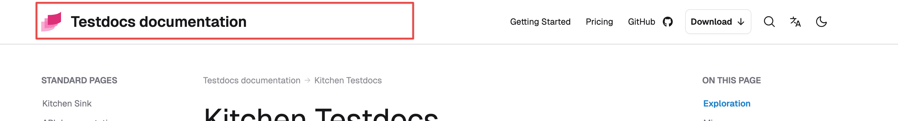
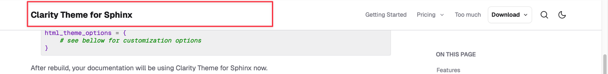

# Header logo and title

The header can show logo image, title text, or both, giving your documentation immediate branding. Swapping variants and tailoring light/dark mode versions is straightforward.

If set, by default, the both logo and title are shown. The header branding region spans roughly half the header width to fit even wide logos and titles.



## Header title

### The same as page title

By default, the header title uses Sphinx standard [`html_title` option](https://www.sphinx-doc.org/en/master/usage/configuration.html#confval-html_title) used for HTML page title (`<title>`). The default value is _\<project\> \<release\> documentation_. E.g., for `project = "Foo"` and `release = "1.5"`, it becomes _Foo 1.5 documentation_.

:::{rubric} Set page and header title
:::

1. In `conf.py`:

   ```py
   html_title = "REST API"
   ```

:::{tip}
Set the same project and HTML title:

```py
project = html_title = "My Awesome Project"
```
:::

### Different than page title

If you want header title different than `html_title`, use the `html_theme_options`'s `header_title` option.

:::{rubric} Set custom header title
:::

1. In `conf.py`:

   ```py
   html_title = "REST API"
   html_theme_options = {
      "header_title": "Getting started with RESTful API"
   }
   ```

### Disable title

To completely disable showing a header title, set the `html_theme_options`'s `header_title` option to `False`.

:::{rubric} Disable header title
:::

1. In `conf.py`:

   ```py
   html_theme_options = {
      "header_title": False
   }
   ```
## Header logo

### Same logo for light and dark mode

Use the standard Sphinx `html_logo`; the file appears in both modes.

:::{rubric} Set a header logo
:::

1. In `conf.py` set `html_logo` to a path relative to `conf.py` or an external URL.

   ```py
   html_logo = "logo.svg"
   ```

### Different logo for light and dark mode

If the light logo doesn’t look good against a dark background, supply a separate dark variant.

:::{rubric} Set a dark mode logo
:::

1. Set the light variant with `html_logo` option.
1. Set the dark variant using `html_theme_options`'s `logo_dark` option.
1. Add the dark logo file (or its folder) to `html_static_path` so Sphinx copies it. (The light logo is copied automatically.)

For example:
```py
html_static_path = ["_static"]
html_logo = "_static/logo.svg"
html_theme_options = {
      "logo_dark": "_static/logo-dark.svg"
}
```

### Automatic dark mode logo

Alternatively, invert the light logo automatically. This can be “good enough” if you lack a dedicated dark asset.

:::{rubric} Turn on automatic dark logo
:::

1. Set the light variant with `html_logo`.
1. Enable inversion with `html_theme_options`'s `logo_dark_invert` option.

   ```py
   html_theme_options = {
       "logo_dark_invert": True
   }
   ```

### Logo link

The logo (or title) links to the _root document_ by default (usually `index.md` / `index.rst`).

:::{rubric} Change logo link
:::

1. In `conf.py`'s `html_theme_options`, set `logo_url` option. The value might be any browser valid URL address.

   :::{code-block} python

   html_theme_options = {
       "logo_url": "https://readcraft.io"
   }
   :::

### Disable logo

To completely disable logo, just unset the `html_logo` option.

:::{rubric} Unset logo, use title only
:::

1. In `conf.py` unset the logo: `html_logo = None`.
1. Set title using `html_title` option.

   ```py
   html_logo = None
   html_title = "My project"
   ```


