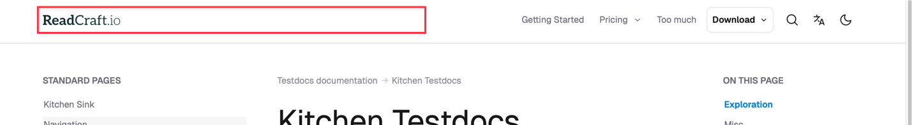
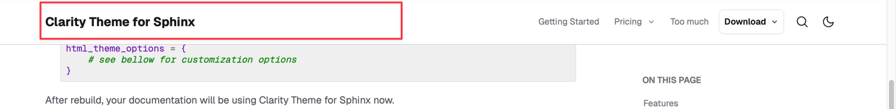

# Header logo or title

The header can show either a logo image or text, giving your documentation immediate branding. Swapping variants and tailoring light/dark mode versions is straightforward. The logo region spans roughly half the header width to fit even wide logos or names.



## No logo (text only)

Instead of an image you can display arbitrary text — commonly a project or organization name.

:::{rubric} Set header text instead of logo
:::

1. In `conf.py` unset the logo: `html_logo = None`.
1. Set text via `html_title` (default is _\<project\> \<release\> documentation_). If `project = "Foo"` and release is `1.0`, the text becomes _Foo 1.0 documentation_.

   ```py
   html_logo = None
   html_title = "My project"
   ```

:::{tip}
Set the same project and HTML title:

```py
project = html_title = "My Awesome Project"
```


:::

## Same logo for light and dark mode

Use the standard Sphinx `html_logo`; the file appears in both modes.

:::{rubric} Set a header logo
:::

1. In `conf.py` set `html_logo` to a path relative to `conf.py` or an external URL.

   ```py
   html_logo = "logo.svg"
   ```

## Different logo for light and dark mode

If the light logo doesn’t look good against a dark background, supply a separate dark variant.

:::{rubric} Set a dark mode logo
:::

1. Set the light variant with `html_logo` option.
1. Set the dark variant using `html_theme_options`'s `logo_dark` option.
1. Add the dark logo file (or its folder) to `html_static_path` so Sphinx copies it. (The light logo is copied automatically.)

For example:
```py
html_static_path = ["_static"]
html_logo = "_static/logo.svg"
html_theme_options = {
      "logo_dark": "_static/logo-dark.svg"
}
```

## Automatic dark mode logo

Alternatively, invert the light logo automatically. This can be “good enough” if you lack a dedicated dark asset.

:::{rubric} Turn on automatic dark logo
:::

1. Set the light variant with `html_logo`.
1. Enable inversion with `html_theme_options`'s `logo_dark_invert` option.

   ```py
   html_theme_options = {
       "logo_dark_invert": True
   }
   ```

## Logo link

The logo (or title) links to the _root document_ by default (usually `index.md` / `index.rst`).

:::{rubric} Change logo link
:::

1. In `conf.py`'s `html_theme_options`, set `logo_url` option. The value might be any browser valid URL address.

   :::{code-block} python

   html_theme_options = {
       "logo_url": "https://readcraft.io"
   }
   :::
