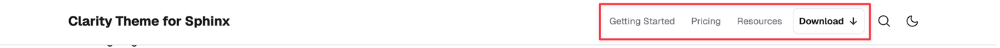

# Header menu

Add a navigation menu to the header with links or call‑to‑action (CTA) buttons.



:::{rubric} Configure a header menu
:::

1. In `conf.py`'s `html_theme_options`, set `header_menu` option.
1. Provide a list of dictionaries with required keys:
    - `label`: text or inline HTML (e.g. `<svg>` for an icon)
    - `url`: link target
    - Optional `as: "button"` renders a button style.
1. Example:

   ```py
   html_theme_options = {
       "header_menu": [
           {
               "label": "Getting Started",
               "url": "some/url",
           },
           {
               "label": "Pricing ",
               "url": "some/url",
           },
           {
               "label": "Resources",
               "url": "some/url",
           },
           {
               "label": """Download <svg xmlns="http://www.w3.org/2000/svg" width="16" height="16"    viewBox="0 0 16 16" fill="none" stroke="currentColor" stroke-width="1.5"    stroke-linecap="round" stroke-linejoin="round" aria-hidden="true" focusable="false"><path d="M8 3v8"/><path d="M3.5 8.5L8 13l4.5-4.5"/></svg>""",
               "url": "some/url",
               "as": "button",
           },
       ],
   }
   ```

   :::{note}
    Embedded HTML (like `<svg>`) includes quotes; use a triple‑quoted Python string.
   :::