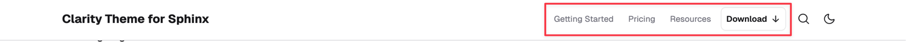
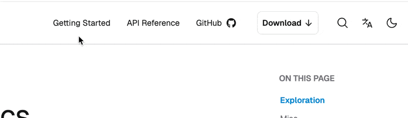

# Header menu

Add a navigation menu to the header with links or call-to-action (CTA) buttons. The header menu appears next to the search icon on the right side of the header.



Key features:

- Display plain text, custom HTML, or buttons
- Link to external URLs or documentation pages
- Add tooltips on hover



## Menu items

Configure the header menu using the `header_menu` option in `html_theme_options`. It accepts a list of menu items.

Each menu item requires the following fields:

- `content`: text or inline HTML (e.g., `<svg>` for an icon)
- `url`: link to either document or URL ([see bellow](#menu-item-links))

Optional fields:

- `as`: render style—supports `"as": "button"` for button styling
- `tooltip`: text to display on hover

For example:

```py
html_theme_options = {
    "header_menu": [
        {
            "content": "Getting Started",
            "url": "https://some/url",
            "tooltip": "Tooltip for Getting Started",
        },
        {
            "content": "API Reference",
            "url": "api",
        },
        {
            "content": """GitHub <svg xmlns="http://www.w3.org/2000/svg" width="24" height="24" viewBox="0 0 24 24"><path fill="currentColor" d="M9.35 16.88c0 .07-.07.12-.17.12S9 17 9 16.88s.08-.12.17-.12s.18.05.18.12m-1-.15c0 .07 0 .15.14.17a.15.15 0 0 0 .2-.07c0-.07 0-.14-.14-.17s-.18 0-.2.07m1.42-.05c-.09 0-.15.08-.14.16s.09.11.19.09s.15-.09.14-.16s-.09-.1-.19-.09M11.9 4A7.83 7.83 0 0 0 4 12.07A8.29 8.29 0 0 0 9.47 20c.41.07.56-.19.56-.4v-2s-2.26.5-2.74-1c0 0-.36-1-.89-1.21c0 0-.74-.52.05-.51a1.67 1.67 0 0 1 1.24.85a1.69 1.69 0 0 0 2.36.69a1.83 1.83 0 0 1 .51-1.11c-1.8-.21-3.62-.47-3.62-3.66A2.54 2.54 0 0 1 7.7 9.7a3.2 3.2 0 0 1 .08-2.24c.68-.22 2.23.89 2.23.89a7.46 7.46 0 0 1 4.05 0s1.55-1.11 2.23-.89a3.14 3.14 0 0 1 .08 2.24a2.6 2.6 0 0 1 .83 1.95c0 3.2-1.9 3.45-3.7 3.66a2 2 0 0 1 .5 1.5v2.77a.42.42 0 0 0 .56.4A8.22 8.22 0 0 0 20 12.07A8 8 0 0 0 11.9 4M7.14 15.41v.17a.12.12 0 0 0 .17 0s0-.11 0-.18s-.13-.03-.17.01m-.35-.27s0 .1.07.13a.09.09 0 0 0 .14 0s0-.1-.07-.13s-.12-.03-.14 0m1 1.18v.21c0 .07.17.08.21 0s0-.14 0-.21s-.13-.05-.17 0Zm-.37-.49v.2c0 .08.14.11.19.08a.16.16 0 0 0 0-.21c-.05-.08-.13-.11-.19-.07"/></svg>""",
            "url": "some/url",
            "tooltip": "Tooltip for GitHub",
        },
        {
            "content": 'Download <svg xmlns="http://www.w3.org/2000/svg" width="16" height="16" viewBox="0 0 16 16" fill="none" stroke="currentColor" stroke-width="1.5" stroke-linecap="round" stroke-linejoin="round" aria-hidden="true" focusable="false"><path d="M8 3v8"/><path d="M3.5 8.5L8 13l4.5-4.5"/></svg>',
            "url": "some/url",
            "as": "button",
            "tooltip": "Download the latest version",
        },
    ],
}
```

:::{note}
Embedded HTML (like `<svg>`) includes quotes—use triple-quoted Python strings.
:::

## Menu item links

The menu item are links. Its the `url` field defines the target. You can link either to

- a page in your documentation, or
- an external address.

The `url` value which does not start with `http` or `https` is considered a path to page in your documentation.

For example, the `user-guide/intro` path will `intro.rst` under `user-guide` folder:

```
docs/
├── user-guide/
│   ├── index.rst
│   └── intro.rst
```