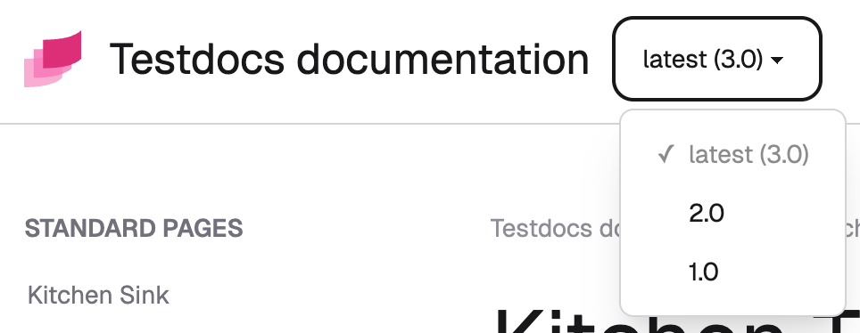

# Version select

Let users switch between different documentation versions with a dropdown selector. The user will select a version, and the theme will redirect them to the corresponding page in a different version.

The version select features:

- The validation and preparation are done at Sphinx build time for better error handling.
- Minimal client-side JavaScript—only for navigation.
- Prevents 404 errors if page for a version doesn't exist.
- Switching preserves URL fragments like `#setup` and `#faq`.
- Highlights the current version in the dropdown.

:::{video} images/version-select.mp4
:::

## Organize Sphinx documentation for multiple versions

The theme makes version switching easy, but doesn't build, prepare or deploy multiple documentation website versions.

Manage both source files (`.rst`, `.md`) and built website files (`.html`, `.css`) across versions. Choose a strategy that matches your project's complexity.

:::{note}
Already have multiple versions set up? Jump to [](#configuration).
:::

### Source files organization

Three common approaches:

**Separate branches** (recommended for large projects)

Each version lives on its own branch (`docs/1.0`, `docs/2.0`, etc.). Built docs deploy to version-specific directories on your hosting.

```
root/
├── docs/
│   ├── conf.py
│   ├── index.rst
│   └── ...

```

**Monorepo approach** (good for smaller projects)

All versions live in a single branch. Use symlinks to sync `conf.py` across versions.

```
root/
├── docs/
│   ├── shared/          # Optional common files (glossary, styles, etc.)
│   ├── v1.0/
│   │   ├── conf.py
│   │   ├── source/
│   │   └── build/
│   ├── v2.0/
│   │   ├── conf.py
│   │   ├── source/
│   │   └── build/
```

**Single source, multiple configs**

```
root/
├── docs/
│   ├── source/          # Shared source files
│   ├── conf-v1.0.py
│   ├── conf-v2.0.py
│   └── build/
```

### Output files organization

Deploy built websites consistently under the same URL pattern. Configure this with the [`version_select_url` option](#version_select_url). Examples: `<version>`, `/docs/<version>`, or `<language>/<version>`.

Build and deploy each version's website separately. Structure them consistently:

```
root/
├── 3.0/
│   ├── _images/
│   │   ├── login.png
│   │   ├── install-schema.png
│   │   └── ...
│   ├── _static/
│   │   ├── logo.svg
│   │   ├── pygments.css
│   │   └── ...
│   ├── api/
│   │   ├── index.html
│   │   ├── auth.html
│   │   └── operations.html
│   ├── user/
│   │   ├── index.html
│   │   ├── setup.html
│   │   └── printing.html
│   ├── index.html
│   ├── introduction.html
│   ├── contributing.html
│   └── ...
├── 2.0/
│   └── ...
└── 1.0/
    └── ...
```

You typically create a script that will build up the above directory structure.

## Configuration

Configure three options in each version's `conf.py` under `html_theme_options`:

- `version_select_url` — URL pattern for the version
- `version_select_current` — the current documentation version
- `version_select_data` — list of available versions

```py
html_theme_options = {
  "version_select_url": "/{version}/",
  "version_select_current": "latest",
  "version_select_data": [
    { "version": "latest", "label": "latest (3.0)" },
    { "version": "2.0" },
    { "version": "1.0" },
  ],
}
```

:::{important}
All versions must use the same URL schema and data. See [Configuration synchronization](#syncing-configuration) for tips.
:::

### `version_select_url`

Specifies the version homepage's URL pattern for navigating between versions. The actual URL is calculated by JavaScript based on the page the user is reading.

- Must include `{version}` placeholder (replaced at runtime with the actual version)
- Invalid: `{ version }`, `{{version}}`, etc.
- Can be a full URL: `https://help.example.com/{version}`
- Or just a path: `/docs/{version}`
- Can end with or without trailing slash `/`

### `version_select_current`

Specifies the current documentation version. {{ project }} uses this to highlight the active version in the dropdown.



This value must match one of the versions in `version_select_data`:

:::{code-block} py
:emphasize-lines: 3, 6

html_theme_options = {
  "version_select_url": "/{version}/",
  "version_select_current": "2.0",
  "version_select_data": [
    { "version": "latest", "label": "latest (3.0)" },
    { "version": "2.0" },
    { "version": "1.0" },
  ],
}
:::

### `version_select_data`

Defines the available versions in the dropdown.

- `version` — required, any string identifying the version
- `label` — optional, displayed name (defaults to `version` if omitted)

**Versions display in the order you list them** (no automatic sorting). Users typically expect latest versions first, so arrange them accordingly.

:::{code-block} py

html_theme_options = {
  "version_select_url": "/{version}/",
  "version_select_current": "2.0",
  "version_select_data": [
    { "version": "v2.0.0", "label": "latest (v2.0.0)" },
    { "version": "v1.30.0" },
    { "version": "v1.0.0" },
    { "version": "v1.0.0rc1", "label": "v1.0.0 RC1" }
  ],
}
:::

## Syncing configuration

Ensure consistent configuration across all versions' `conf.py` files. Since `conf.py` is regular Python, you can set the version dynamically, load from JSON files, or use other methods.

Here are examples of synchronized configuration across 3 versions:


:::::{tab-set}
   
::::{tab-item} 3.0

It is common practice to call the most current version as "latest". Use the `label` field to indicate to users which version number is the latest.
  
:::{code-block} py
:emphasize-lines: 3, 5

html_theme_options = {
  "version_select_url": "/{version}/",
  "version_select_current": "latest",
  "version_select_data": [
    { "version": "latest", "label": "latest (3.0)" },
    { "version": "2.0" },
    { "version": "1.0" },
  ],
}
:::

::::

::::{tab-item} 2.0

:::{code-block} py
:emphasize-lines: 3

html_theme_options = {
  "version_select_url": "/{version}/",
  "version_select_current": "2.0",
  "version_select_data": [
    { "version": "latest", "label": "latest (3.0)" },
    { "version": "2.0" },
    { "version": "1.0" },
  ],
}
:::

::::

::::{tab-item} 1.0

:::{code-block} py
:emphasize-lines: 3

html_theme_options = {
  "version_select_url": "/{version}/",
  "version_select_current": "1.0",
  "version_select_data": [
    { "version": "latest", "label": "latest (3.0)" },
    { "version": "2.0" },
    { "version": "1.0" },
  ],
}
:::

::::

:::::

### Load from JSON example

1. Create the `versions.json` that conforms to [`version_select_data` option](#version_select_data)'s structure.

   ```json
   [
     {
       "version": "latest",
       "label": "latest (3.0)",
       "url": "/en/latest/"
     },
     { "version": "2.0", "url": "/en/2.0/" },
     { "version": "1.0", "url": "/en/1.0/" }
   ]
   ```

1. Save it in the folder with `conf.py`.
1. Load it in `conf.py`:

   ```python
   import json
   from pathlib import Path
   
   versions_file = Path(__file__).parent / "versions.json"
   
   ...
   
   html_theme_options = {
       ...
       "version_select_data": json.loads(versions_file.read_text())
       ...
   }
   ```

### Load from URL example

1. Create a `versions.json` file that conforms to the [`version_select_data` option](#version_select_data) structure.
1. Publish the JSON at a publicly available URL.
1. Load it in `conf.py`:

   ```python
   import requests
   
   ...

   html_theme_options = {
       ...
       "version_select_data": requests.get("https://example.com/versions.json").json()
       ...
   }
   ```

   :::{note}
   The snippet above uses the third-party `requests` library, but you don't need to install it—Sphinx already depends on it.
   :::

## 404 prevention

Before switching versions, a small JavaScript script checks whether the corresponding page exists in the target version to prevent 404 errors.

If the check fails (URL doesn't exist, or CORS/network error occurs), the user is redirected to the version homepage. For example:

1. You're viewing version 2.0 at `https://docs.example.com/2.0/user-guide.html`
2. You switch to version 1.0
3. JavaScript checks if `https://docs.example.com/1.0/user-guide.html` exists
4. If not, you're redirected to `https://docs.example.com/1.0/` instead

:::{caution}
URL checks use the HEAD method and are subject to [CORS restrictions](https://developer.mozilla.org/en-US/docs/Web/HTTP/Guides/CORS). Same-origin requests work fine (the script and docs are on the same domain). In most cases, you will not experience any issues because the script and documentation are on the same site (same-origin).
:::

## Common issues

### JavaScript error: Current version not found in URL

Test your documentation thoroughly—client-side errors can occur:

```
version-select.js:21 Uncaught Error: Current version '3.0' not found in current page URL
```

This error means the URL doesn't contain the version. The script can't extract and replace the version part.

**Example:** If you are viewing a page like `https://docs.example.com/guide/install/` which has no version in the URL, switching versions will fail because the script doesn't know how to construct a new version URL. Your documentation URLs must include the version: `https://docs.example.com/2.0/guide/install/`.