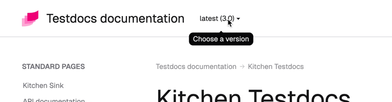
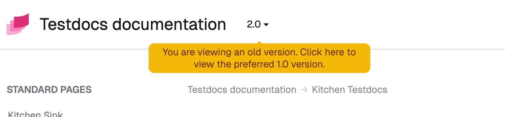

# Version select

Let users switch between different documentation versions using a dropdown selector. When users select a version, the theme automatically redirects them to the corresponding page.

Key features:

- Validation and preparation happen at Sphinx build time for better error handling
- Minimal client-side JavaScript—only for navigation
- Prevents 404 errors when a page doesn't exist in a target version
- Preserves URL fragments like `#setup` and `#faq` when switching
- Highlights the current version in the dropdown
- Shows a warning if users aren't viewing the preferred version



## Organize Sphinx documentation for multiple versions

The theme handles version switching, but you need to manage building, preparing, and deploying multiple documentation versions yourself.

You'll manage both source files (`.rst`, `.md`) and built website files (`.html`, `.css`) across versions. Choose a strategy that fits your project's needs.

:::{note}
Already have multiple versions set up? Jump to [](#configuration).
:::

### Source files organization

Here are three common approaches:

**Separate branches** (recommended for large projects)

Each version lives on its own branch (`docs/1.0`, `docs/2.0`, etc.). Built documentation deploys to version-specific directories on your hosting.

```
root/
├── docs/
│   ├── conf.py
│   ├── index.rst
│   └── ...

```

**Monorepo approach** (good for smaller projects)

All versions live in a single branch. Use symlinks or other mechanisms to share `conf.py` across versions.

```
root/
├── docs/
│   ├── shared/          # Optional common files (glossary, styles, etc.)
│   ├── v1.0/
│   │   ├── conf.py
│   │   ├── source/
│   │   └── build/
│   ├── v2.0/
│   │   ├── conf.py
│   │   ├── source/
│   │   └── build/
```

**Single source, multiple configs**

```
root/
├── docs/
│   ├── source/          # Shared source files
│   ├── conf-v1.0.py
│   ├── conf-v2.0.py
│   └── build/
```

### Output files organization

Deploy built websites consistently under the same URL pattern using the [`version_select_url` option](#version_select_url). Examples include `<version>`, `/docs/<version>`, or `<language>/<version>`.

Build and deploy each version separately with a consistent structure:

```
root/
├── 3.0/
│   ├── _images/
│   │   ├── login.png
│   │   ├── install-schema.png
│   │   └── ...
│   ├── _static/
│   │   ├── logo.svg
│   │   ├── pygments.css
│   │   └── ...
│   ├── api/
│   │   ├── index.html
│   │   ├── auth.html
│   │   └── operations.html
│   ├── user/
│   │   ├── index.html
│   │   ├── setup.html
│   │   └── printing.html
│   ├── index.html
│   ├── introduction.html
│   ├── contributing.html
│   └── ...
├── 2.0/
│   └── ...
└── 1.0/
    └── ...
```

Typically, you'll create a script to build and organize this directory structure.

## Configuration

Add these required options to each version's `conf.py` under `html_theme_options`:

- `version_select_url` — URL pattern for the version
- `version_select_current` — the current documentation version
- `version_select_data` — list of available versions

To show a warning when users aren't viewing the preferred version, also set:
- `version_select_preferred` — the preferred version
- `version_select_preferred_warning` — customize the warning message (optional)

For example:

```py
html_theme_options = {
  "version_select_url": "/$VERSION$/",
  "version_select_current": "latest",
  "version_select_data": [
    { "version": "latest", "label": "latest (3.0)" },
    { "version": "2.0" },
    { "version": "1.0" },
  ],
  "version_preferred": "latest"
}
```

:::{important}
All versions must use the same URL schema and data. See [Configuration synchronization](#syncing-configuration) for tips.
:::

### `version_select_url`

Defines the URL pattern for the version homepage. JavaScript calculates the actual URL based on the current page.

- Must include `$VERSION$` placeholder (replaced at runtime with the actual version)
- Can be a full URL: `https://help.example.com/$VERSION$`
- Or just a path: `/docs/$VERSION$`
- Can end with or without a trailing slash

### `version_select_current`

Sets the current documentation version. The theme highlights this version in the dropdown.


This value must match one of the versions in `version_select_data`:

:::{code-block} py
:emphasize-lines: 3, 6

html_theme_options = {
  "version_select_url": "/$VERSION$/",
  "version_select_current": "2.0",
  "version_select_data": [
    { "version": "latest", "label": "latest (3.0)" },
    { "version": "2.0" },
    { "version": "1.0" },
  ],
}
:::

### `version_select_data`

Defines the available versions in the dropdown.

- `version` — required, any string identifying the version
- `label` — optional, displayed name (defaults to `version` if omitted)

**Versions appear in the order you list them**—there's no automatic sorting. Users typically expect latest versions first, so order them accordingly.

:::{code-block} py

html_theme_options = {
  "version_select_url": "/$VERSION$/",
  "version_select_current": "2.0",
  "version_select_data": [
    { "version": "v2.0.0", "label": "latest (v2.0.0)" },
    { "version": "v1.30.0" },
    { "version": "v1.0.0" },
    { "version": "v1.0.0rc1", "label": "v1.0.0 RC1" }
  ],
}
:::

### `version_select_preferred`

The preferred version must exist in `version_select_data`. When users click the warning message, they're redirected to the preferred version.



### `version_select_preferred_warning`

Customize the message shown when users aren't viewing the preferred version. Use the `$PREFERRED$` placeholder to insert the preferred version name.

The default message is: _"You are viewing an old version. Click here to view the preferred $PREFERRED$ version."_

:::{code-block} py
:emphasize-lines: 3, 9, 10

html_theme_options = {
  "version_select_url": "/$VERSION$/",
  "version_select_current": "2.0",
  "version_select_data": [
    { "version": "3.0", "label": "latest (3.0)" },
    { "version": "2.0" },
    { "version": "1.0" },
  ],
  "version_select_preferred": "3.0",
  "version_select_preferred_warning": f"Click to see $PREFERRED$ version."
}
:::

## Syncing configuration

Keep configuration consistent across all versions' `conf.py` files. Since `conf.py` is regular Python, you can use any mechanism to sync it—load from JSON, read from a Python package, etc.

Ensure these options are synchronized across versions:
- `version_select_url`
- `version_select_data`
- `version_select_preferred`
- `version_select_preferred_warning` (if using warnings)

For example, here's how three versions' `conf.py` files might look:

:::::{tab-set}
   
::::{tab-item} 3.0 (latest)

:::{code-block} py
:emphasize-lines: 3, 5

html_theme_options = {
  "version_select_url": "/$VERSION$/",
  "version_select_current": "latest",
  "version_select_data": [
    { "version": "latest", "label": "latest (3.0)" },
    { "version": "2.0" },
    { "version": "1.0" },
  ],
  "version_select_preferred": "latest"
}
:::

Common practice: call the most current version "latest" and use the `label` field to show the actual version number.

::::

::::{tab-item} 2.0

:::{code-block} py
:emphasize-lines: 3

html_theme_options = {
  "version_select_url": "/$VERSION$/",
  "version_select_current": "2.0",
  "version_select_data": [
    { "version": "latest", "label": "latest (3.0)" },
    { "version": "2.0" },
    { "version": "1.0" },
  ],
  "version_select_preferred": "latest"
}
:::

::::

::::{tab-item} 1.0

:::{code-block} py
:emphasize-lines: 3

html_theme_options = {
  "version_select_url": "/$VERSION$/",
  "version_select_current": "1.0",
  "version_select_data": [
    { "version": "latest", "label": "latest (3.0)" },
    { "version": "2.0" },
    { "version": "1.0" },
  ],
  "version_select_preferred": "latest"
}
:::

::::

:::::

### Load current version from Python package

If your Python package and documentation are in the same repository, you can read the version directly from the package:

```py
version = my_package_name.__version__
...
html_theme_options = {
  ...
  "version_select_current": version,
  ...
}
```

### Load data from JSON

1. Create a `versions.json` file following the [`version_select_data`](#version_select_data) structure:

   ```json
   [
     {
       "version": "latest",
       "label": "latest (3.0)",
       "url": "/en/latest/"
     },
     { "version": "2.0", "url": "/en/2.0/" },
     { "version": "1.0", "url": "/en/1.0/" }
   ]
   ```

2. Place it in the same folder as `conf.py`.
3. Load it in `conf.py`:

   ```python
   import json
   from pathlib import Path
   
   versions_file = Path(__file__).parent / "versions.json"
   
   ...
   
   html_theme_options = {
       ...
       "version_select_data": json.loads(versions_file.read_text())
       ...
   }
   ```

### Load data from URL

1. Create a `versions.json` file following the [`version_select_data`](#version_select_data) structure.
2. Publish it at a publicly accessible URL.
3. Load it in `conf.py`:

   ```python
   import requests
   
   html_theme_options = {
       ...
       "version_select_data": requests.get("https://example.com/versions.json").json()
       ...
   }
   ```

   :::{note}
   This example uses the `requests` library, which Sphinx already depends on—no extra installation needed.
   :::

## Preventing 404 errors

Before switching versions, a small JavaScript script checks if the page exists in the target version.

If the page doesn't exist, or if a network error occurs, users are redirected to the version homepage instead. Here's an example:

1. Viewing version 2.0 at `https://docs.example.com/2.0/user-guide.html`
2. Switch to version 1.0
3. JavaScript checks if `https://docs.example.com/1.0/user-guide.html` exists
4. If not, redirect to `https://docs.example.com/1.0/` instead

:::{caution}
URL checks use the HEAD method and are subject to [CORS restrictions](https://developer.mozilla.org/en-US/docs/Web/HTTP/Guides/CORS). Same-origin requests (script and docs on the same domain) work fine. Most setups won't experience issues since the documentation is self-hosted.
:::

## Troubleshooting

### Error: "Current version not found in URL"

If you see this error in the browser console:

```
version-select.js:21 Uncaught Error: Current version '3.0' not found in current page URL
```

It means the current page URL doesn't include the version. The script can't extract the version to replace it when switching.

**Solution:** Your documentation URLs must include the version. For example:
- ❌ Invalid: `https://docs.example.com/guide/install/`
- ✅ Valid: `https://docs.example.com/2.0/guide/install/`